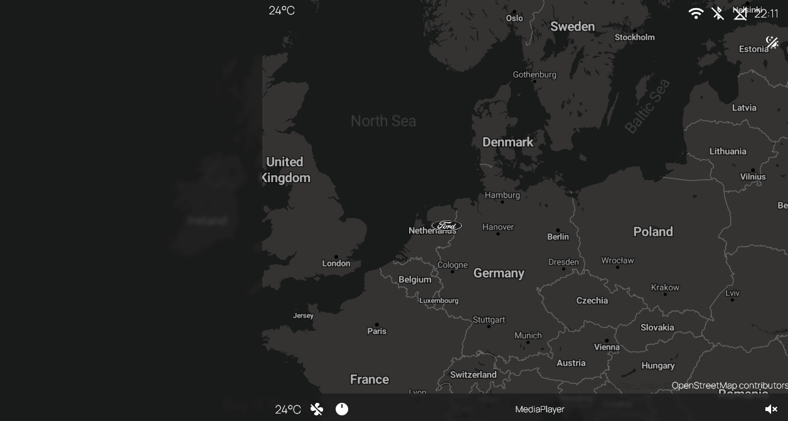

# CarPi

A custom, personal car infotainment system built for my car using a Raspberry Pi 5 and ESP32-WROVER.

---

## Overview

this app reads live data from my car, displays it on a touchscreen dashboard, and allows me to control various car features remotely through a companion [mobile app](https://github.com/JoostKraan/Car-Control-Application).

While the code and documentation are public for inspiration or reference, this system is highly customized for my specific hardware setup and vehicle.

---

## Features

### Current & Planned

- **Turn-by-turn navigation**
- **Central locking control**
- **Throttle input monitoring**
- **Status light display** (high/low beam, indicators, etc.)
- **Media player** (control phone audio and play through car radio)
- **Live sensor readouts:**
  - Outside & interior temperature
  - GPS location & speed (hall effect sensor)
- **RFID/NFC access**
- **Mobile app integration**

---

## Hardware (My Setup)

- [Raspberry Pi 5 4GB](https://core-electronics.com.au/media/catalog/product/cache/d5cf359726a1656c2b36f3682d3bbc67/r/a/raspberry-pi-5-case-red-white-active-cooler.jpg)
- [ESP32-WROVER-B, SIM7000G (LTE, WiFi, Bluetooth)](https://m.media-amazon.com/images/I/617l1UeFBVL._AC_UF350,350_QL80_.jpg)
- [Waveshare 7" HDMI QLED Display 1024x600](https://www.tinytronics.nl/image/cache/catalog/products_2022/7qp-caplcd-4-600x600.jpg)

#### Sensors

- [DFRobot Gravity DS18B20 Temperature Sensor V2](https://www.tinytronics.nl/image/cache/catalog/products/product-003936/dfrobot-gravity-ds18b20-temperature-sensor-front-side-1500x1500.jpg) × 2
- [Hall Effect Switch Module](https://www.tinytronics.nl/image/cache/catalog/data/product-757/hall%20effect%20sensor%20module-1500x1500.jpg)
- [RFID NFC Kit PN532](https://www.hackerstore.nl/Afbeeldingen/1606groot.jpg)
- GPS Module (included with ESP32)

*Hardware may change as the project evolves.*

---

## Software

- [Flutter](https://github.com/flutter/flutter) (main dashboard UI)
- Dart (application logic)
- WebSockets for real-time updates

---

## Progress

  
_Data from ESP32 is sent over WebSocket and displayed live in the Flutter app. GPS data updates in real time._

---

## License

MIT

---

## Contributing

This is a personal project, but pull requests and ideas are always welcome! Feel free to open issues or suggestions if you find something useful or interesting.

---

## Related Projects

- [Car Control Mobile App](https://github.com/JoostKraan/Car-Control-Application)
